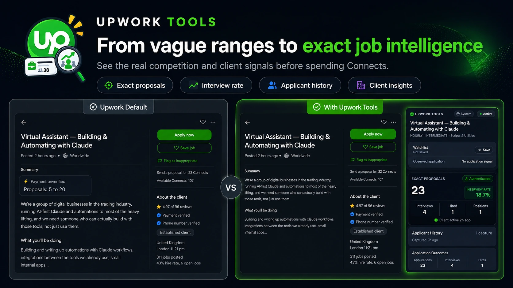
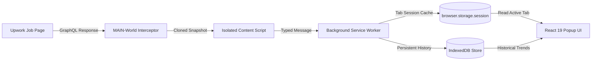

# Upwork Tools

<p align="center">
  
</p>

<p align="center">
  <strong>See the verified facts behind an Upwork job before spending Connects.</strong><br />
  A fast, local-first browser extension for transparent job intelligence and client hiring insights.
</p>

<p align="center">
  <a href="https://github.com/sfsajid91/upwork-tools/releases/latest"></a>
  <a href="#manifest-v3"></a>
  <a href="#bun"></a>
  <a href="#react"></a>
  <a href="#typescript"></a>
  <a href="#tailwind"></a>
  <a href="#tests"></a>
  <a href="#license"></a>
</p>

<p align="center">
  <a href="#the-problem-vs-the-solution">Why Upwork Tools?</a> •
  <a href="#key-features">Key Features</a> •
  <a href="#privacy--security-first">Privacy & Trust</a> •
  <a href="#how-it-works">Architecture</a> •
  <a href="#installation--quick-start">Quick Start</a> •
  <a href="#contributing">Contributing</a>
</p>


<p align="center">
  
</p>

---

## The Problem vs. The Solution

Upwork proposal fees (Connects) have skyrocketed, while the platform's default UI hides critical hiring signals behind vague ranges and obscure tabs.

| Upwork Default Experience | With Upwork Tools |
| :--- | :--- |
| **Vague Ranges:** Displays "20 to 50 proposals" or "50+" while you burn 16 Connects. | **Exact Competition:** Displays the exact applicant count (e.g., `38 proposals`). |
| **Ghost Opportunities:** Jobs stay active even after the client hired 1/1 freelancers. | **Hiring Warnings:** Flags `⚠ Position Filled` and client interview progress. |
| **Opaque Client Pay:** Headline says `$50/hr`, but client history reveals a `$10/hr` average. | **Pay Profile:** Calculates median fixed payments and historical hourly averages paid. |
| **Unresponsive Clients:** Client posted 40 jobs in 2 months with 0 total hires. | **Real Hire Rate:** Calculates true hire percentage ($\frac{\text{Jobs with Hires}}{\text{Jobs Posted}}$). |
| **Slow, Bloated Extensions:** Third-party extensions scrape DOM or ping third-party cloud servers. | **Zero-Footprint Observer:** 100% local, reads existing response, zero duplicate requests. |

---

## Key Features

### 1. 🎯 Competition Intelligence
- **Exact Proposals:** Unmasks the raw applicant count directly from Upwork's authenticated response.
- **Proposal Velocity:** Tracks application speed over time (e.g., `+4.2 proposals/hour`) so you know when competition is rising rapidly.
- **Interview Ratio:** Real-time percentage of interviewed candidates vs. total applicants ($\frac{\text{Interviewed}}{\text{Proposals}}$).
- **Open Positions:** Displays total positions available vs. already hired.

### 2. 🔍 Client Quality & Payment Reality
- **True Hire Rate:** Shows exact hiring track record ($\frac{\text{Hired Jobs}}{\text{Total Posted}}$).
- **Client Pay Profile:** Analyzes client work history to compute median fixed contract amounts and realistic hourly pay.
- **Payment & Activity Verification:** Verifies payment method status, total spend, rating, and relative activity (e.g., `Client active 2h ago`).
- **Location & Tenure:** Displays client country, city, and platform membership date.

### 3. ⚖️ Your Fit & Qualification Audit
- **Requirement Checklist:** Expandable audit showing matched vs. total qualifications (English, Location, JSS, Hours).
- **Rate Delta Comparison:** Compares your profile rate directly against the client's historical average.
- **Restriction Detection:** Warns if the job has strict geographic, JSS, or earnings gates.
- **Personal Skill & Portfolio Match:** Matches job ontology skills against your locally stored skills and portfolio tags.

### 4. ⚡ Local Power-User Workflow
- **Offline Watchlist:** Save jobs to a local watchlist to monitor competition trends across sessions.
- **Application Tracker:** Tracks application milestones (`Viewed` → `Applied` → `Interview` → `Hired`) with explicit conversion denominators.
- **Theme Engine:** Clean interface supporting System, Dark, and Light themes.
- **Zero Hallucinations:** When data is missing upstream, it is marked **Not available**. No fabricated AI scores or fake "win probabilities."

---

## Privacy & Security First

Browser extensions should never ask for blind trust. Upwork Tools is designed from the ground up as a **zero-trust, local-only utility**:

- 🛡️ **Zero Duplicate Network Requests:** Uses a `document_start` observer that intercepts the GraphQL response Upwork already sent. It makes **zero** outbound fetch calls.
- 🔒 **No Cloud Backend or Third-Party Servers:** No telemetry, no Google Analytics, no tracking pixels, and no remote databases. All code executes on your machine.
- 📦 **Strict Storage Boundaries:**
  - `browser.storage.session`: Stores only the active tab's ephemeral snapshot (cleared immediately when the tab closes or navigates).
  - `IndexedDB`: Stores your local watchlist and 90-day history (strictly bounded to a maximum of 100 snapshots per job).
  - `browser.storage.local`: Stores your local portfolio and theme preferences.
- 🧹 **One-Click Total Wipe:** A dedicated button in Settings immediately purges all IndexedDB tables, watchlists, and cached captures.

---

## How It Works

Upwork Tools operates as a lightweight, non-interfering observer:



1. **Passive Interception:** When you open an authenticated job page, the MAIN-world script intercepts `gql-query-get-auth-job-details-v2`.
2. **Safe In-Memory Cloning:** The response stream is cloned and validated. The host page's original response remains completely untouched.
3. **Boundary Normalization:** Raw GraphQL data is normalized into a strict, nullable `JobInsights` model. Invalid or missing properties become `null`; valid zeroes remain `0`.
4. **Isolated Delivery:** The background worker stores the latest snapshot in memory for the active tab and logs historical metrics into local IndexedDB.
5. **Instant UI Render:** The React 19 popup queries the background worker for an instant, zero-latency render.

See [`docs/architecture.md`](docs/architecture.md) for full technical specifications on runtime boundaries, storage models, and protocol contracts.

---

## Installation & Quick Start

### 🚀 For Freelancers & Users (No Coding Required)

[](https://github.com/sfsajid91/upwork-tools/releases/latest)

1. **Download & Extract:**
   - Download the latest **`upwork-tools-*.zip`** from [GitHub Releases](https://github.com/sfsajid91/upwork-tools/releases/latest).
   - Extract the ZIP file into a folder on your computer.
2. **Open Extensions Page:**
   - In Chrome, Brave, Edge, or Arc, type `chrome://extensions` in your address bar and press Enter.
3. **Enable Developer Mode:**
   - Toggle the **Developer mode** switch ON in the top-right corner of the page.
4. **Load the Extension:**
   - Click the **Load unpacked** button in the top-left corner.
   - Select the extracted folder (the directory containing `manifest.json`).
5. **Pin & Browse:**
   - Click the puzzle piece icon (`🧩`) in your browser toolbar, pin **Upwork Tools**, and open any Upwork job listing!

---

### For Developers & Contributors

#### Prerequisites
- [Bun](https://bun.sh/) (v1.2+ recommended)
- Chromium 111+ (Chrome, Brave, Edge)

#### Setup & Development
```sh
# Clone the repository
git clone https://github.com/sfsajid91/upwork-tools.git
cd upwork-tools

# Install dependencies and prepare WXT types
bun install

# Start development server with live reload (Chromium)
bun run dev
```

#### Production Builds
```sh
# Build for Chromium (.output/chrome-mv3)
bun run build

# Create distributable ZIP package
bun run zip
```

---

## Development & Testing

Upwork Tools enforces high code quality, strict TypeScript typing, and Biome linting across the entire codebase.

```sh
# Run the complete test suite (176 tests)
bun run test

# Run TypeScript typecheck (no-emit)
bun run compile

# Run Biome linter
bun run lint

# Check Biome formatting
bun run format:check

# Auto-format code
bun run format
```

### Project Directory Structure

```text
upwork-tools/
├── src/
│   ├── entrypoints/                 # WXT Extension Entrypoints
│   │   ├── background.ts            # Service Worker: tab state & IndexedDB coordinator
│   │   ├── content.ts               # Isolated context: event validation & forwarding
│   │   ├── interceptor.content.ts   # MAIN-world context: document_start network observer
│   │   ├── options/                 # Options Page: Profile, Portfolio & Data management
│   │   └── popup/                   # Popup Interface: React 19 UI & Tailwind styles
│   └── lib/                         # Deterministic Business Logic & Core Libraries
│       ├── insights.ts              # Nullable JobInsights parser & GraphQL schema mapping
│       ├── database.ts              # IndexedDB manager, store definitions & auto-cleanup
│       ├── velocity.ts              # Proposal rate-of-change & velocity calculations
│       ├── conversion.ts            # Application funnel aggregations & conversion rates
│       ├── hiring-warnings.ts       # Deterministic status, fill, and invite warnings
│       ├── skill-match.ts           # Ontology skill matching & normalization
│       ├── portfolio-match.ts       # Local portfolio token overlap & ranking engine
│       └── format.ts                # Formatting utilities for currency, dates, and stats
├── tests/                           # Complete Bun Test Suite (Unit & Integration)
│   ├── entrypoints/                 # Entrypoint integration tests
│   ├── fixtures/                    # Test fixtures (sample GraphQL payload)
│   └── lib/                         # Unit tests for domain logic
├── docs/                            # Architecture & Technical Specifications
│   └── architecture.md              # Living technical architecture document
├── wxt.config.ts                    # WXT framework & Manifest V3 configuration
├── tsconfig.json                    # TypeScript configuration
└── biome.json                       # Biome formatting and linting rules
```

---

## Technical Specifications & Details

<details>
<summary><strong>Storage Schema & Retention Limits</strong></summary>

Upwork Tools uses a tri-tier local storage architecture:
1. **`browser.storage.session`**: Holds the latest normalized `JobInsights` model keyed by browser tab ID. Automatically purged when the tab is closed or navigates away.
2. **`IndexedDB` (`upwork-tools`)**:
   - `jobs`: Normalized job metadata.
   - `jobSnapshots`: Historical snapshots (`jobId`, `applicants`, `interviewed`, `hired`, `capturedAt`). Maximum 100 snapshots per job, 90-day global retention.
   - `applications`: Application funnel status (`viewedAt`, `appliedAt`, `interviewedAt`, `hiredAt`).
   - `watchlist`: Bookmarked jobs with competition references.
   - `latestCaptures`: Latest complete normalized capture for restoration.
3. **`browser.storage.local`**: Holds user settings, custom hourly rate, skills, portfolio entries, and theme preferences.
</details>

<details>
<summary><strong>Supported Upwork GraphQL API</strong></summary>

Upwork Tools specifically inspects the authenticated job-details query:
- **Endpoint:** `https://www.upwork.com/api/graphql/v1`
- **Alias:** `gql-query-get-auth-job-details-v2`
- **Method:** `POST`
- **Safety Policy:** Non-matching queries are completely ignored. Inspection errors are caught gracefully and will never disrupt the host page.
</details>

---

## Contributing

Contributions are welcome! To contribute:

1. **Fork** the repository and create your branch from `main`:
   ```sh
   git checkout -b feat/your-feature-name
   ```
2. **Make your changes** adhering to the project's design principles:
   - Must remain 100% local-first (no telemetry, no external calls).
   - Missing data must remain `null` / "Not available" (no invented numbers).
   - Write tests for any new normalization or calculation logic.
3. **Verify tests and linting:**
   ```sh
   bun run compile && bun run lint && bun run format:check && bun run test
   ```
4. **Commit with conventional commits** and open a Pull Request.

---
## License

This project is licensed under the [MIT License](LICENSE).  
Upwork is a registered trademark of Upwork Inc. Upwork Tools is an independent, open-source project and is not affiliated with, endorsed by, or sponsored by Upwork Inc.
