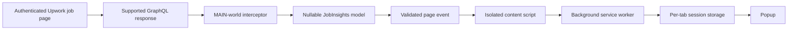

# Upwork Tools

> Transparent job-quality insights for the Upwork tab you are already viewing.

Upwork Tools is a local-first Manifest V3 browser extension for freelancers evaluating authenticated Upwork job pages. It reads the supported job-details GraphQL response already received by Upwork, normalizes the useful signals, and presents them in a compact popup without making duplicate requests or changing the page.

## Why it exists

The first question when opening a job is simple:

> Is this opportunity worth a closer look?

Upwork Tools makes the most decision-relevant facts visible quickly, starting with **Exact Proposals** and continuing with competition, client quality, fit, warnings, and transparent history.

No opaque score. No guessed recommendation. No backend.

## Current capabilities

The current implementation can show:

| Area | Signals |
| --- | --- |
| Competition | Exact proposals, interviewed, hired, positions, interview rate |
| Activity | Client's last recorded activity |
| Client quality | Payment verification, rating, reviews, total spend, hire rate, average hourly rate, member date, location |
| Your fit | Qualification matches, your hourly rate, client average rate, rate context |
| Warnings | Filled position, already hired, already applied, client invitation |
| Restrictions | Meaningful location, JSS, language, portfolio, and start requirements when present |
| Client history | Recent-job UI is implemented; production history-path fix is tracked |
| Popup states | Loading, no-data, error, and available insight states |

Values that are missing or invalid upstream remain unavailable. Valid zeroes remain zeroes.

## How it works



1. A document-start MAIN-world script targets the supported `gql-query-get-auth-job-details-v2` response.
2. Matching responses are cloned before inspection.
3. The response is normalized into a nullable `JobInsights` model.
4. A versioned page event crosses into the isolated content script.
5. The content script validates the event and sends it to the background worker.
6. The worker validates the sender tab, stores the latest normalized snapshot in `browser.storage.session`, and appends normalized history to IndexedDB when a job ID exists.
7. The popup requests the active tab's snapshot and renders factual metrics.

Inspection is designed to be non-interfering; persistence failures degrade to the session snapshot without affecting Upwork.

## Privacy and product boundaries

Upwork Tools is intentionally narrow and local-only:

- Captures happen only when the user naturally opens a job and Upwork has already delivered the supported job-details response.
- The extension never polls, creates duplicate Upwork requests, or changes Upwork's DOM/page UI.
- `browser.storage.session` holds the latest per-tab snapshot for popup reads.
- IndexedDB holds normalized persistent job snapshots, applications, and watchlist data; `browser.storage.local` holds small profile, portfolio, preference, and UI settings.
- Persistent history is retained for exactly 90 days, with a maximum of 100 snapshots per job.
- One clear-data operation removes this extension's history, applications, and watchlist while preserving unrelated browser storage.
- Missing or invalid upstream values remain unavailable; valid zeroes remain zeroes. The extension never invents values.
- No backend, account requirement, cloud sync, cross-device history, analytics, or telemetry.
- No Connect-spending tracking, automatic applications, or hidden scoring/recommendations.
- No raw GraphQL responses or review text are persisted.

The historical data boundary is deterministic, bounded, local, and user-clearable. See [`docs/NEW_FEATURES_PLAN.md`](docs/NEW_FEATURES_PLAN.md) for implementation sequencing.

## Known release blockers

The implemented storage and audit paths are verified. Remaining release work is
popup/options integration, visible clear-data controls, tracker/watchlist UI, and
manual Chromium smoke coverage.

| Area | Current limitation | Tracking |
| --- | --- | --- |
| Popup integration | Historical metrics and profile matchers are not yet wired into the popup | [`docs/NEW_FEATURES_PLAN.md`](docs/NEW_FEATURES_PLAN.md) |
| Clear-data UI | Database clear APIs exist; a user-visible confirmation control remains | [`docs/NEW_FEATURES_PLAN.md`](docs/NEW_FEATURES_PLAN.md) |
| Tracker/watchlist | Application tracker, conversion stats, and watchlist UI remain future work | [`docs/NEW_FEATURES_PLAN.md`](docs/NEW_FEATURES_PLAN.md) |
| Release verification | Manual Chromium scenarios and production build checks remain | [`docs/NEW_FEATURES_PLAN.md`](docs/NEW_FEATURES_PLAN.md) |

The roadmap and dependency-aware fix order are documented in
[`docs/NEW_FEATURES_PLAN.md`](docs/NEW_FEATURES_PLAN.md).

## Requirements

- [Bun](https://bun.sh/)
- Chromium 111+ is the configured primary target.

- Firefox development/build tooling for the Firefox target
- An authenticated Upwork session with a supported job-details page

## Install for development

```sh
bun install
```

The post-install step prepares WXT's generated types and configuration.

## Development

Start the Chromium-targeted WXT development build:

```sh
bun run dev
```

Start the Firefox-targeted development build:

```sh
bun run dev:firefox
```

WXT owns manifest generation and build orchestration. Do not edit generated `.wxt/` files or generated `.output/` files by hand.

## Build and package

Build the production extension:

```sh
bun run build
```

Build the Firefox target:

```sh
bun run build:firefox
```

Create distributable archives:

```sh
bun run zip
bun run zip:firefox
```

Generated output is placed under `.output/`.

## Load the unpacked extension

### Chromium

1. Run `bun run build`.
2. Open `chrome://extensions` or the equivalent extensions page.
3. Enable **Developer mode**.
4. Choose **Load unpacked**.
5. Select `.output/chrome-mv3`.
6. Open an authenticated Upwork job-details page.
7. Let the job details finish loading, then open the Upwork Tools popup.

### Firefox

1. Run `bun run build:firefox`.
2. Open `about:debugging`.
3. Select **This Firefox**.
4. Choose **Load Temporary Add-on**.
5. Select the generated `manifest.json` under `.output/`.
6. Open an authenticated supported Upwork job-details page and then the popup.

Temporary Firefox extensions must be loaded again after the browser restarts.

## Quality checks

Run the full local checks before shipping a change:

```sh
bun run test
bun run compile
bun run lint
bun run format:check
bun run build
```

Available scripts:

| Command | Purpose |
| --- | --- |
| `bun run test` | Run Bun tests |
| `bun run compile` | TypeScript no-emit check |
| `bun run lint` | Biome lint |
| `bun run format:check` | Biome formatting check |
| `bun run format` | Format files in place |
| `bun run build` | Production Chromium build |
| `bun run build:firefox` | Production Firefox build |
| `bun run zip` | Package Chromium build |
| `bun run zip:firefox` | Package Firefox build |

## Manual smoke test

Use an authenticated Upwork job-details page and verify:

- the popup shows a loading state before the snapshot is available;
- the popup shows a useful empty state when no supported response was captured;
- the popup renders Exact Proposals when the response arrives;
- valid zero values remain visible as zero;
- unavailable fields say `Not available` rather than showing guessed values;
- warnings appear only when their conditions are present;
- after the history-path fix, client history and related jobs expand when data exists;
- after the navigation-lifecycle fix, the previous tab snapshot is not visible after navigation;
- opening another tab does not show this tab's data;
- after interceptor hardening, Upwork continues to behave normally if inspection fails.

## Repository map

| Path | Responsibility |
| --- | --- |
| `entrypoints/interceptor.content.ts` | Installs the MAIN-world response interceptor |
| `entrypoints/content.ts` | Validates page events in the isolated world |
| `entrypoints/background.ts` | Validates messages and owns per-tab session storage |
| `entrypoints/popup/` | React popup, states, hierarchy, and presentation |
| `lib/interceptor.ts` | Fetch, Response, JSON, and XHR inspection |
| `lib/insights.ts` | Normalized model, parser, derived metrics, warnings, and history |
| `lib/protocol.ts` | Versioned page-event and runtime-message contracts |
| `lib/format.ts` | Currency, percentage, date, rating, and relative-time formatting |
| `lib/theme.ts` | Popup theme preference and system-theme handling |
| `assets/` and `public/` | Source and static extension assets |
| `docs/` | Product scope, audit findings, and feature plans |

## Design principles

### Facts before scores

Show the underlying count, rate, date, or state. Derived metrics are explicit and explainable. Missing upstream data is normal, not an invitation to invent certainty.

### Observe, do not interfere

Upwork owns the request and page. The extension observes a supported response, clones it for inspection, and leaves the original request/response chain untouched.

### Local by default

The latest per-tab snapshot uses `browser.storage.session`; normalized history, applications, and watchlist data use bounded, clearable IndexedDB storage. Profile, portfolio, preference, and UI settings use `browser.storage.local`.

### Compact by default

Exact Proposals leads the popup. Secondary information stays grouped, conditional, or expandable so the card remains useful at a glance.

## Roadmap

The next feature plan is intentionally phased:

1. Correct audit and contract issues — complete.
2. Add local IndexedDB foundations and applicant snapshots — complete.
3. Add proposal velocity, client pay history, and stronger related-job matching — pure metrics complete; popup integration remains.
4. Add qualification details, personal skill matching, and portfolio matching — pure helpers complete; options/popup integration remains.
5. Add observed application tracking, conversion statistics, and a watchlist.
6. Finish popup/options UX, documentation, and release hardening.

Every implementation task is expected to receive task-specific verification and an independent code-reviewer subagent review before it is committed.

See [`docs/AUDIT_ISSUES.md`](docs/AUDIT_ISSUES.md) for verified gaps and [`docs/NEW_FEATURES_PLAN.md`](docs/NEW_FEATURES_PLAN.md) for the dependency-aware implementation plan.

## Contributing

1. Read the product boundaries before changing behavior.
2. Reuse the normalized model and protocol contracts instead of adding parallel data paths.
3. Keep new logic deterministic and local.
4. Add tests for observable behavior and boundary conditions.
5. Run the quality checks and manual smoke test for the affected context.
6. Have the task diff reviewed before committing.

Keep the extension boring in the best way: transparent inputs, small boundaries, safe failure behavior, and no hidden decisions.
