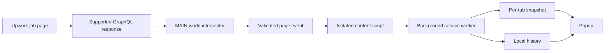

# Upwork Tools

<p align="center">
  
</p>

<p align="center">
  <strong>See the facts behind an Upwork job before you apply.</strong><br />
  A local-first browser extension for transparent job and client insights.
</p>

<p align="center">
  Manifest V3 · React · TypeScript · Bun · Chromium 111+
</p>

Upwork Tools reads the authenticated job-details response that Upwork has already
loaded in the active tab. It normalizes useful signals and shows them in a compact
popup—without polling, duplicate requests, page overlays, or a backend.

## What you get

### Job snapshot

- **Exact Proposals** as the primary competition signal
- Interviewed, hired, positions, and interview rate
- Client activity and job status
- Budget, type, tier, category, posting date, and duration when available

### Client context

- Payment verification, rating, reviews, total spend, and hire rate
- Average hourly paid, member date, and location
- Recent hiring history and related previous jobs
- Historical fixed-payment and hourly-rate context

### Your fit

- Qualification totals and expandable requirement details
- Your hourly rate compared with the client's average rate
- Deterministic rate context and observed application state
- Explicit location, JSS, language, hours, earnings, portfolio, and start restrictions

### Local workflow

- Save a job to a local watchlist
- Track applicant snapshots over time, including change and proposal velocity when enough observations exist
- Store a local profile and portfolio for deterministic matching support
- Switch between system, light, and dark themes
- Clear locally stored job, history, application, and watchlist data from Settings

Missing or invalid upstream values remain **Not available**. Valid zeroes remain
zeroes. Upwork Tools shows evidence and derived metrics; it does not produce an
opaque score, winning probability, or apply/skip recommendation.

## How it works



1. Open an authenticated Upwork job normally.
2. The document-start interceptor observes only the supported job-details response and clones matching responses before inspection.
3. The parser produces a nullable `JobInsights` snapshot.
4. The isolated content script validates the event and sends it to the background worker.
5. The worker keeps the latest snapshot for the tab and appends normalized local history when a job ID exists.
6. The popup reads the active tab's verified snapshot and optional history.

See [`docs/architecture.md`](docs/architecture.md) for the runtime boundaries,
storage schema, and failure behavior.

## Install for development

### Requirements

- [Bun](https://bun.sh/)
- Chromium 111+ for the primary target
- An authenticated Upwork session with a supported job-details page

```sh
bun install
```

### Run locally

```sh
# Chromium-targeted development build
bun run dev
```

### Load the unpacked extension

#### Chromium

1. Run `bun run build`.
2. Open `chrome://extensions` and enable **Developer mode**.
3. Choose **Load unpacked**.
4. Select `.output/chrome-mv3`.
5. Open an authenticated Upwork job, let its details load, and open the popup.

The extension's options page contains local profile, portfolio, and data controls.

## Commands

| Command | Purpose |
| --- | --- |
| `bun run dev` | Start the Chromium WXT development build |
| `bun run build` | Build the Chromium extension |
| `bun run zip` | Package the Chromium build |
| `bun run test` | Run Bun tests |
| `bun run compile` | Run the TypeScript no-emit check |
| `bun run lint` | Run Biome lint |
| `bun run format:check` | Check Biome formatting |

Generated `.wxt/` and `.output/` files are build artifacts. Do not edit them by
hand.

## Local-first by design

- `browser.storage.session` holds the latest snapshot and identity metadata per tab.
- IndexedDB stores normalized jobs, applicant snapshots, observed application state, watchlist records, and latest captures.
- `browser.storage.local` stores the profile, portfolio, and UI settings.
- History is retained for 90 days and capped at 100 snapshots per job.
- Raw GraphQL responses and review text are not persisted.
- IndexedDB failures degrade to the current session snapshot where possible.
- The extension has no backend, accounts, cloud sync, telemetry, analytics, polling, Connect-spending tracking, or automatic applications.
- It does not modify Upwork's DOM or change the original request/response behavior.

## Development principles

1. Read the product boundary before changing behavior.
2. Reuse `JobInsights` and the versioned protocol instead of adding parallel data paths.
3. Keep new logic deterministic, local, and nullable at upstream boundaries.
4. Preserve host-page behavior when inspection or storage fails.
5. Add focused tests for observable behavior and boundary conditions.
6. Run the affected checks before shipping.

Upwork Tools is in active development. Upstream Upwork response changes may require
parser and contract updates.
