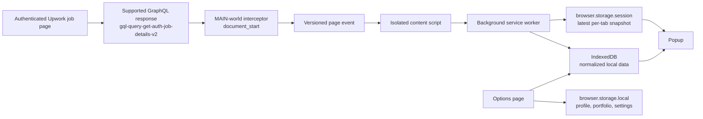

# Architecture

Upwork Tools is a local-first Manifest V3 extension. It observes one authenticated
Upwork response, converts it into a validated normalized model, and presents the
latest model for the active tab.

The architecture optimizes for four invariants:

1. **Observe, do not interfere.** The host page keeps control of its requests,
   responses, and DOM.
2. **Facts before inference.** Missing values stay `null`; derived metrics are
   deterministic and explainable.
3. **Tab and job isolation.** A popup can only read data verified for its active
   tab and current job.
4. **Local, bounded persistence.** No backend, telemetry, cloud sync, or raw
   response archive exists.

## Runtime topology



## Extension contexts

| Context | File | Runtime responsibility |
| --- | --- | --- |
| MAIN world | `entrypoints/interceptor.content.ts` | Install response inspection at `document_start` on Upwork pages. |
| Isolated content | `entrypoints/content.ts` | Validate same-origin page events, forward captures, and answer replay requests. |
| Service worker | `entrypoints/background.ts` | Validate messages, serialize tab mutations, persist captures, serve popup reads, and update the action badge. |
| Popup | `entrypoints/popup/` | Read the active tab and render insights, history, conversion, watchlist, warnings, and fit views. |
| Options | `entrypoints/options/` | Edit the local profile and portfolio, browse/remove the watchlist, and clear IndexedDB job data. |

`wxt.config.ts` defines the React module, Manifest V3 metadata, `storage`
permission, Upwork host permissions, and the Chromium 111 minimum version. WXT
generates the manifest and build output.

## Capture lifecycle

### 1. Observe an existing response

`lib/interceptor.ts` wraps supported fetch/response/XHR inspection paths. It
recognizes the job-details alias
`gql-query-get-auth-job-details-v2` and checks the expected response markers.
Matching responses are cloned before parsing. The original response chain is
returned unchanged.

Inspection is guarded by host-page safety checks:

- installation is idempotent through a page flag;
- later page-side reassignment is re-wrapped without replacing the page's
  function permanently;
- inspection errors and rejected inspection promises are contained;
- URL-less arbitrary JSON is not treated as a job capture;
- normalized captures are emitted only in a supported job-page context.

### 2. Normalize the payload

`lib/insights.ts` converts the upstream payload into `JobInsights`:

- `job`: identity, title, status, type, budget, dates, category, skills, and
  restrictions;
- `activity`: exact proposals, interviewed, interview rate, hired, positions,
  and last client activity;
- `client`: verification, rating, reviews, spend, hire rate, paid rates,
  membership, location, and related counts;
- `fit`: qualification totals/details, local hourly rate, rate context, and
  observed application state;
- `history`: recent client jobs and deterministic related-job matches;
- `warnings`: filled position, already hired, already applied, and invitation
  signals.

Normalization is nullable at the boundary. Invalid strings, numbers, booleans,
arrays, and nested records are rejected or omitted. A valid numeric zero is
preserved as zero.

The parser delegates focused behavior to deterministic helpers:

- `lib/qualification.ts` parses meaningful qualification matches;
- `lib/restrictions.ts` extracts explicit location, JSS, language, hours,
  earnings, portfolio, and start requirements;
- `lib/skills.ts` and `lib/skill-match.ts` normalize and compare skill labels;
- `lib/portfolio-match.ts` ranks local portfolio entries using explainable title,
  skill, and tag overlap;
- `lib/pay-profile.ts`, `lib/applicant-metrics.ts`, and `lib/velocity.ts` derive
  factual historical metrics.

### 3. Cross the page boundary

`lib/protocol.ts` owns the versioned contracts:

- page source: `upwork-tools`;
- page event version: `1`;
- page event type: `JOB_DETAILS_RECEIVED`;
- runtime messages for storing, reading, and replaying captures.

The isolated content script accepts an event only when all of these checks pass:

- `event.source === window`;
- `event.origin === window.location.origin`;
- source, version, type, and payload pass the protocol guards;
- the normalized payload passes `isJobInsights`.

It then sends `STORE_JOB_INSIGHTS` to the service worker with the normalized
payload. The service worker validates the sender tab ID before accepting it.

### 4. Persist and isolate by tab

The service worker serializes mutations per tab. Each tab has a generation that
advances when navigation starts or the tab is removed. A capture from an older
generation cannot write after a newer navigation boundary.

Before a popup read is returned, the worker verifies both:

- the current tab URL still identifies the requested job; and
- the session metadata job ID matches both the requested job and normalized
  payload job ID.

This prevents a previous job's snapshot from appearing in a new job tab. When a
session snapshot is unavailable, the worker can ask the content script to replay
its latest in-page capture or restore a matching capture from IndexedDB.

## Storage model

### Session storage

`browser.storage.session` is the fast, per-tab read path. Keys are derived from
the tab ID:

- `job-insights:{tabId}` — latest normalized `JobInsights` snapshot;
- `job-insights:{tabId}:metadata` — normalized job ID and capture timestamp.

Session data is not a cross-tab cache. The worker clears both session keys when
navigation starts or a tab is removed. Navigation generations prevent stale
writes, and current-job validation prevents stale reads while a new page loads.

### IndexedDB

`lib/database.ts` opens database `upwork-tools`, version `2`, with these stores:

| Store | Contents | Keying |
| --- | --- | --- |
| `jobs` | Normalized job and client metadata | `jobId` |
| `jobSnapshots` | Competition observations: applicants, interviewed, hired, positions, capture time | Auto-increment ID; indexed by job and time |
| `applications` | Observed application state and factual timestamps | `jobId` |
| `watchlist` | Locally saved job metadata and latest snapshot reference | `jobId` |
| `latestCaptures` | Latest complete normalized capture for restoration | `jobId` |

Persistence is skipped when a normalized job ID is unavailable. IndexedDB
failures are contained so the session snapshot can still serve the popup.

History retention is enforced during snapshot writes and retention runs:

- records older than 90 days are removed;
- no job retains more than 100 snapshots;
- identical adjacent competition captures within the deduplication window are
  not appended;
- only normalized data needed by the product is stored.

The Options page's **Clear local data** action clears the extension's IndexedDB
job, history, application, watchlist, and latest-capture stores. It preserves the
profile, portfolio, and UI settings held in `browser.storage.local`.

### Local settings

`browser.storage.local` contains validated extension-owned values:

- `userProfile`: fallback hourly rate, skills, and preferences;
- `portfolio`: title, skills, tags, and optional HTTP(S) URL;
- `uiSettings`: theme mode and feature flags.

Portfolio URLs are stored as text. The extension does not fetch or open them.
Theme initialization includes a compatibility path for the legacy local theme
key, then persists the validated mode in extension storage.

## Popup read flow

`entrypoints/popup/App.tsx` starts in `loading`, queries the active tab, and sends
`GET_JOB_INSIGHTS`. It renders:

- `empty` when no validated snapshot is available;
- `error` when the active tab cannot be read;
- `ready` when a normalized snapshot is available.

For a ready job with an ID, the popup also requests `GET_JOB_HISTORY`. The worker
returns applicant history summary, proposal velocity, client pay profile, and
conversion stats aggregated from all locally observed application records.
History is optional: if it cannot be read, the popup keeps the current session
snapshot and explains that it is session-only.

After the snapshot and optional history are read, the popup loads validated
`userProfile` and `portfolio` values from `browser.storage.local`. It derives a
nullable skill-match summary and bounded portfolio matches locally. A captured
Upwork hourly rate remains primary; the configured fallback is used only when the
capture has no freelancer rate. Settings failures leave the core snapshot
available without personalization.

`InsightsView.tsx` renders the product hierarchy:

1. job title, status, theme control, watchlist, and observed application state;
2. warnings and explicit restrictions;
3. Exact Proposals hero metric with competition counters and interview rate;
4. applicant history when multiple captures support a trend;
5. application outcomes with explicit sample sizes;
6. client track record;
7. client pay profile when history is available;
8. qualification details, profile skill match, and personal rate context;
9. matching portfolio work when deterministic overlap exists;
10. expandable related previous jobs and client hiring history;
11. posting date, budget, and local-capture provenance.
The formatter layer (`lib/format.ts`) turns nullable values into stable display
strings such as `Not available`; it does not fill missing data.

## Options flow

`entrypoints/options/App.tsx` reads and validates local profile and portfolio
values and loads the locally saved watchlist collection. It exposes:

- profile skills and fallback hourly rate;
- portfolio entry create, edit, and remove operations;
- saved-job titles, IDs, saved dates, and removal;
- clear local IndexedDB job data with confirmation;
- explicit success and error states when browser storage is unavailable.

The options page does not send profile or portfolio data to Upwork or a server.
The popup consumes these local values only for deterministic display; it never
sends profile, portfolio, or matching data to Upwork or a server.

## Failure and security boundaries

| Boundary | Required behavior |
| --- | --- |
| Upwork response inspection | Clone before parsing; preserve the original request/response behavior. |
| Page → isolated script | Require same-origin, same-window, versioned, typed events. |
| Content → worker | Validate runtime messages and sender tab identity. |
| Worker → popup | Verify current URL, job ID, payload, and session metadata. |
| Worker → IndexedDB | Check tab generation before and after async writes. |
| Missing upstream fields | Preserve `null`; never invent a value or recommendation. |
| Storage failure | Degrade optional history and persistence without breaking the page. |
| User deletion | Clear only extension-owned local job data through the database adapter. |

The extension intentionally has no backend, account system, cloud sync, telemetry,
analytics, polling, duplicate job-details requests, Connect-spending tracker,
automatic application flow, or Upwork DOM mutation.

## Verification map

Behavior is covered by focused Bun tests beside the implementation. Important
contracts include:

- `tests/interceptor.test.ts`, `tests/content.test.ts`, and
  `tests/protocol.test.ts` for capture and boundary validation;
- `tests/background.test.ts` for per-tab storage, replay, navigation, and
  message behavior;
- `lib/database.test.ts` and `tests/storage-degradation.test.ts` for schema,
  retention, deduplication, and graceful storage failure;
- `lib/insights.test.ts`, `tests/insights.test.ts`, and feature tests for
  normalization, warnings, history, matching, and derived metrics;
- `entrypoints/popup/InsightsView.test.tsx` and
  `entrypoints/options/App.test.tsx` for user-facing state behavior.

Run the project checks with:

```sh
bun run test
bun run compile
bun run lint
bun run format:check
bun run build
```
